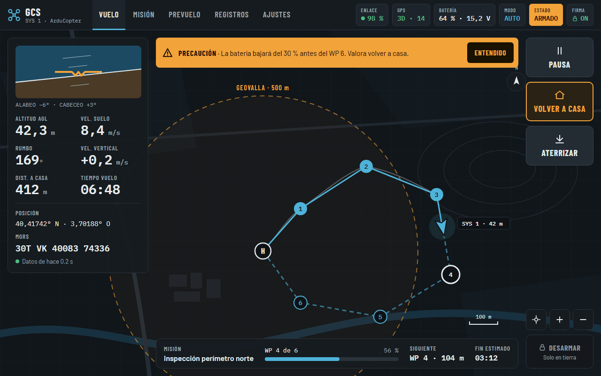
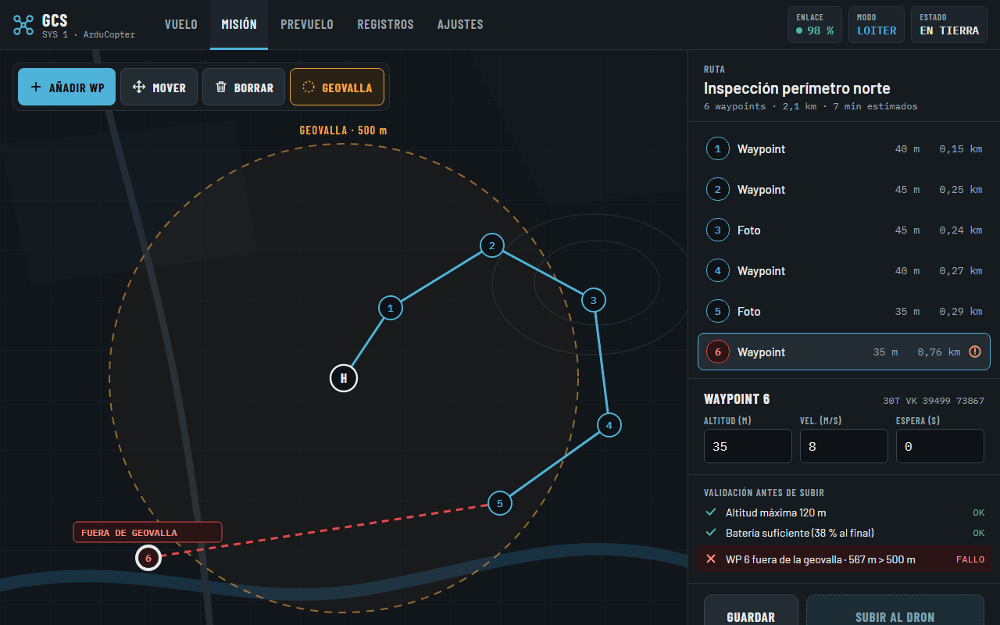
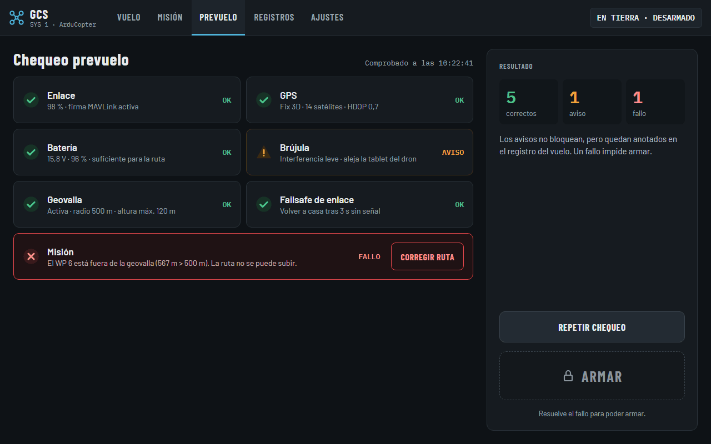
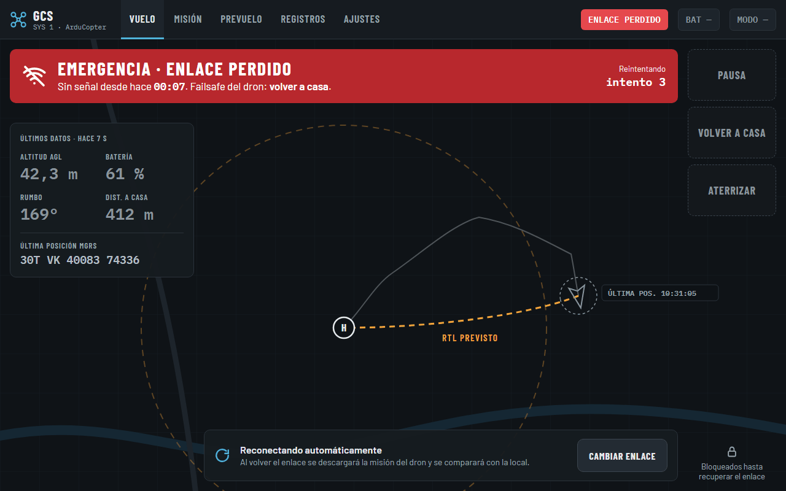
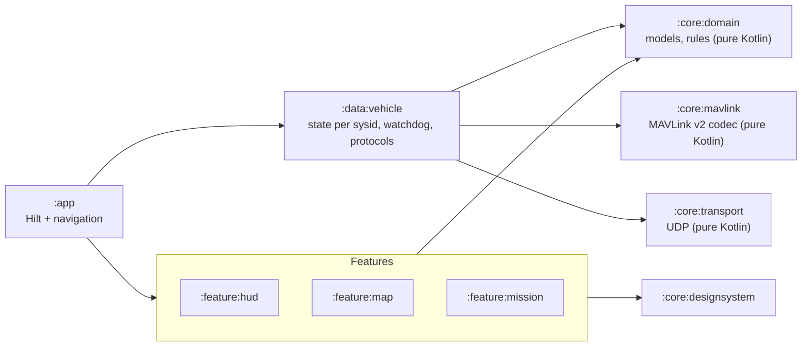

# Ground Control Station (GCS)

An Android ground control station for ArduPilot drones over **MAVLink v2 on UDP**: real-time
telemetry, a map, and automatic routes — waypoint missions the drone flies on its own — with a
hand-written MAVLink codec, tested against the official ArduPilot simulator.

> [!WARNING]
> **Educational project. Not for real operations.** GCS is developed and tested only against
> ArduPilot SITL (the official simulator). Never send commands or missions to a real vehicle without
> a physical transmitter and a pilot ready to take over, and comply with your aviation authority's
> rules (in Spain, AESA: operator registration and open-category UAS training).

## Goal

GCS is a portfolio project that shows advanced Android work in a defense and aerospace context:
real-time data, a binary communications protocol written from scratch, maps, and a system that stays
safe when something fails (link loss, corrupted packets, half-uploaded missions).

It follows practices **inspired by** the sector — requirement IDs with requirement → test
traceability (in the spirit of DO-178C), architecture decision records, an OWASP MASVS checklist —
without claiming compliance with any standard. For reference, STANAG 4586 is NATO's standard
interface for UAV control systems; GCS does not implement it.

What it is not: a joystick. Manual piloting stays on the physical transmitter; the app supervises and
sends missions.

## Status

Each phase ends with a git tag, a GitHub Release and an update of this table.

| Phase | Scope | Done when | Status |
|---|---|---|---|
| v0.0 Setup | Repository, modules, Hilt, quality gates, CI, docs, SITL flying | CI passes and the phone counts UDP packets arriving from the simulator | 🚧 In progress |
| v0.1 Connection | MAVLink v2 codec (framing, CRC, CRC_EXTRA), HEARTBEAT, link-loss watchdog, state per system ID | The app shows connected/disconnected, mode and armed state, and warns when the simulator stops; codec tested with real and corrupted packets | ⏳ |
| v0.2 Telemetry | Position, attitude, battery, speeds in a HUD with data age, MGRS, prioritized alerts, night mode | Values match QGroundControl, MGRS matches a reference converter, low battery triggers the right alert | ⏳ |
| v0.3 Map and recording | Vehicle, heading, trail and home on MapLibre; flight recording (.tlog) and replay | The drone moves on the map during a simulated flight and the flight can be replayed without the simulator | ⏳ |
| v0.4 Commands and pre-flight | Arm, takeoff, RTL, land with ACK, timeout, retries and confirmation; pre-flight check that blocks arming | An unanswered command is retried and ends in a clear error; arming is impossible with a red check | ⏳ |
| v0.5 Automatic routes | Waypoint editor, Room, validation, mission upload protocol | A route is created, uploaded and flown; a route outside the geofence is rejected before sending | ⏳ |
| v0.6 Link security | MAVLink 2 message signing, key in Android Keystore, MASVS checklist | An unsigned or replayed packet is discarded and logged | ⏳ |
| v0.7 Interoperability | Vehicle position as Cursor on Target, visible in ATAK-CIV | The simulated drone appears in ATAK moving in real time | ⏳ |
| v1.0 Robustness and release | Offline mode, offline maps, reconnection, full traceability, APK release | Cutting the simulator's network triggers the failsafe, the app shows it and recovers on its own | ⏳ |

## UI prototype

Tablet screens from the UI prototype (in Spanish), used as the reference for the design system:

| Flight | Route editor |
|---|---|
|  |  |
| **Pre-flight check** | **Link lost** |
|  |  |

## Architecture



- Dependencies flow one way; `./gradlew verifyModuleGraph` fails the build if a module breaks the
  rules (for example, a feature reaching the codec or the network).
- `:core:mavlink` is pure Kotlin with no dependencies at all — no Android, no MAVLink library. It is
  written by hand ([ADR 0001](docs/adr/0001-own-mavlink-codec.md)).
- Safety-critical rules (mission validation, pre-flight checks, geo math, data staleness) live in
  `:core:domain`, in pure Kotlin.
- `:core:testing` holds shared test helpers and is only a test dependency.
- Why there is a separate domain layer: [ADR 0004](docs/adr/0004-domain-layer.md).

**Stack:** Kotlin, Jetpack Compose + Material 3, Coroutines/Flow, Hilt, Gradle convention plugins
(`build-logic`), JUnit 5 + MockK + Kluent + Turbine, detekt (with Compose rules), ktlint, Android
Lint, Kover, GitHub Actions. MapLibre Compose (v0.3) and Room (v0.5) arrive in their phases.

## Getting started

Requirements: JDK 21 (Gradle provisions the toolchain), Android SDK with API 37, a device or an
emulator running Android 8.0+ (API 26).

```bash
./gradlew assembleDebug          # build the app
./gradlew test                   # unit tests
./gradlew ktlintCheck detekt verifyModuleGraph lintDebug test assembleDebug   # everything CI runs
```

### Running against ArduPilot SITL

All development happens against ArduPilot SITL (ArduCopter), with QGroundControl connected to the
same simulator as the reference.

1. **Start SITL**, either
   - Windows: Mission Planner → *Simulation* → *Multirotor*, forwarding MAVLink to the targets below, or
   - WSL/Linux, from an ArduPilot checkout
     ([SITL docs](https://ardupilot.org/dev/docs/sitl-simulator-software-in-the-loop.html)):
     ```bash
     sim_vehicle.py -v ArduCopter --console --map --out=udp:<DEVICE_IP>:14550 --out=udp:127.0.0.1:14551
     ```
2. **Connect the app:**
   - Physical device (recommended): same Wi-Fi as the PC, SITL sending to `<DEVICE_IP>:14550`.
   - Emulator: SITL sending to `127.0.0.1:14550` on the host, then
     `adb emu redir add udp:14550:14550`.
3. **Reference:** QGroundControl listening on another UDP port (e.g. 14551) to compare values.

The connection itself arrives in v0.1; in v0.0 the app only shows the setup screen. The full
procedure, including capturing packets for tests, is in the `sitl-verify` skill
(`.claude/skills/sitl-verify/SKILL.md`).

## Git hooks

The repository uses [pre-commit](https://pre-commit.com) for: whitespace and end-of-file fixes,
YAML and merge-conflict checks, a 2 MB file-size limit, secret scanning (gitleaks), Conventional
Commit messages with an issue number, and the Gradle checks (ktlint format + check, detekt, module
rules).

```bash
pip install pre-commit        # or: pipx install pre-commit (version 4.4.0 or newer)
pre-commit install            # installs the pre-commit and commit-msg hooks
pre-commit run --all-files    # optional: run everything once
```

On Windows, if `pre-commit` is not on your `PATH`, use `py -m pre_commit install` and
`py -m pre_commit run --all-files`. The Gradle hooks call the Gradle wrapper with `java -jar
gradle/wrapper/gradle-wrapper.jar` (exactly what `./gradlew` runs), so they work the same on
Windows, macOS and Linux; `java` must be on your `PATH`.

## Documentation

- [CONTRIBUTING.md](CONTRIBUTING.md) — workflow from idea to merged PR.
- [docs/requirements.md](docs/requirements.md) — requirements and the requirement → test matrix.
- [docs/adr/](docs/adr/) — architecture decision records.
- [docs/security.md](docs/security.md) — OWASP MASVS checklist.
- [CLAUDE.md](CLAUDE.md) — rules for AI assistants working on this repository.

## License

GCS is licensed under the [Apache License 2.0](LICENSE).

The bundled fonts keep their own license: [Barlow and Barlow Condensed](https://github.com/jpt/barlow)
and [IBM Plex Mono](https://github.com/IBM/plex) are licensed under the SIL Open Font License 1.1 —
see [`core/designsystem/src/main/assets/licenses/`](core/designsystem/src/main/assets/licenses/).
